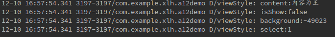
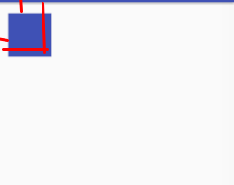
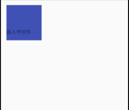
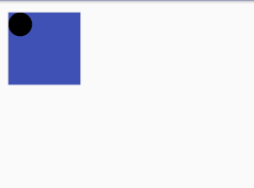

# 自定义View

### 引言
自定义View，一个顾名思义的东西，在Android开发中说多也不多，不多在面向百度/谷歌的开发大快人心的使用着，说少也不少，任何APP都想把自己的应用做的美轮美奂的。

## 简介
在开始关于自定义的View的话题时，先对对他做个简单的介绍把，虽然小猪前辈在之前的问题也有提及（[View与ViewGoup的概念](http://www.runoob.com/w3cnote/android-tutorial-view-viewgroup-intro.html)），但是感觉有点粗糙(逃，这是前辈一年多前写的，那时候我还在搭酱油呢！)。

Android给我们有限的控件时，同时也提供了扩展的渠道，通过继承控件，可以任性的丰富我们的APP(控件)。也就是所谓的自定义让Android能像js等语言在github,掘金等很多社区中有大量的开源，好的作品不断的会被学习仿效，这么说来，这个自定义View(Group)看起来非学不可了。
打住，当然一味的追求自定义在实际开发中不是特别好，尤其是面对适配的问题，虽然说和上面一句话有点矛盾，希望大家仁者见仁智者见智（其实博主不怎么写自定义控件，因为material design足以完成个性的花样了，当然该说的还是要说，每星期的博客还是给自己交代的[哈哈！]）。

## 自定义View的继承与构造方法

凡事总有有个开头，关于集成的话，其实只要是View的子类包括View就可以了，当然View的子类(比如TextView,ImageView都已经自带了一些属性，如何选择请自行掂量)，自定义啥的就先从构造函数说起吧

**话不多说，先上代码**

	//就称呼为方法一吧
	public MyView(Context context) {
        super(context);
    }
	//就称呼为方法二吧
    public MyView(Context context, AttributeSet attrs) {
        super(context, attrs);
    }
    
> 如果这个控件会在java代码中new的话，必须实现方法一，如果控件直接在xml中使用，必须实现方法二，两者至少实现一个，也有的时候，可以简单粗暴点，把方法一中的 `super(context)` 改成 `this(context,null)`。当然，什么情况下可以这么做就不阐述了，下面我们还是介绍下关于　AttributeSer这个参数把。

### AttributeSer - 自定义属性

每个控件都会有属性，既然是自定义控件怎么能少了自定义属性呢！
１．为了方便展开话题，我们先照做在	`res/values/` 目录下添加一个 `attrs.xml` 这个文件。

	<?xml version="1.0" encoding="utf-8"?>
	<resources>
    	<!-- 这里会写什么呢！，当然是我们的自定义属性 -->
        <declare-styleable name="MyViewStyle" >
               <declare-styleable name="MyViewStyle" >
                <attr name="content" format="string" />
                <attr name="isShow" format="boolean"/>
                <attr name="background" format="color"/>
                <attr name="select" >
                    <flag name="s1" value="１"/>
                    <flag name="s2" value="2"/>
                    <flag name="s3" value="3"/>
                </attr>
        </declare-styleable>
	</resources>
    
**支持的自定义属性**

* reference:引用资源
* string:字符串
* Color：颜色
* boolean：布尔值
* dimension：尺寸值
* float：浮点型
* integer：整型
* fraction：百分数
* enum：枚举类型
* flag：位或运算

２.有了这些自定义属性接下来当然就是依附在我们需要的自定义控件上了，先写在xml代码上把。

	<com.xlhgo.viewdemo.MyView
        app:content="内容为王"
        app:is_show="false"
        app:view_background="@color/colorAccent"
        app:select="s1"
        android:layout_width="wrap_content"
        android:layout_height="wrap_content" />
	
> 做好了上面两步以后你或许会波不急待的去运行demo,或许你会发现毛都没出来,
	
    
> 我才没开始多久呢，给我点时间，下面才是重点。

３. 既然有了自定义属性与控件，接下来就是要在我们的java代码中去获取这些自定义属性了了。

	private String mContent;
    private Boolean mIsShow;
    private int mBackground;
    private int mSelect;
    public MyView(Context context, AttributeSet attrs) {
        super(context, attrs);

        TypedArray typedArray = context.obtainStyledAttributes(attrs,R.styleable.MyViewStyle);

        if(typedArray != null){
            //这里要注意，String类型是没有默认值的，所以必须定义好，不然又是空指针大法
            mContent = typedArray.getString(R.styleable.MyViewStyle_content);
            mIsShow = typedArray.getBoolean(R.styleable.MyViewStyle_is_show, true);
            mBackground = typedArray.getColor(R.styleable.MyViewStyle_view_background, Color.RED);
            mSelect = typedArray.getInt(R.styleable.MyViewStyle_select, 0);
        }
        Log.d("viewStyle","content:"+mContent);
        Log.d("viewStyle","isShow:"+mIsShow);
        Log.d("viewStyle","background:"+mBackground);
        Log.d("viewStyle","select:"+mSelect);
    }
    
> 最后日志输出：
> 

成功获取到这些属性以后，就下来才是真正的自定义施展的时候，

## 自定义控件 - View - onMeasure
既然是一个控件，啥都别说，肯定要先有他的宽高，但是我们明明已经在xml中定义了控件的 `layout_widght 与 layout_height`，为什么还要特地重写自定义控件的。至于为什么请看下面。

** 几个概念 **
> Android系统给我们提供了一个　MeasureSpec类，通过它来帮助我们测量View，MeasureSpec是一个32的int值，其中高２为为测量模式，低30位为测量的大小，这难道是二进制！是的，但是大可放心，google还是挺为广大数学渣着想的，通过MeasureSpec的方法可以获取我们需要的数值。
> ***
> 再来说说测量模式把，测试模式可以为一下三种：
> * EXACTLY:精确模式
> 		当我们将控件的layout_width与layout_height属性制定为具体数值时(排除wrap_content)，系统就使用这个模式，(**同时View类的onMeasure默认是EXACTLY模式，所以不重写onMeasure的话，就只能使用默认模式**)
> * AT_MOST:最大值模式
> 		当控件的layout_width属性或layout_height属性为wrap_content时，控件大小一般随着子控件或内容的变化而变化，此时控件的此尺寸只要不超过父控件允许的最大尺寸。
> * UNSPECIFIED：
> 		它不能其大小测量模式，View想多大就多大，通常情况在回执自定义View时才使用。

懵懂了以上的几个概念以后就开始来重写这个方法把，或许你会波不急待，因为如果你对先前对自定义View没有认识，也会像我一开始看了还是一脸懵逼像。

	    @Override
    protected void onMeasure(int widthMeasureSpec, int heightMeasureSpec) {
        super.onMeasure(widthMeasureSpec, heightMeasureSpec);
        //设置控件的宽高，记住这里默认是px，记得要分辨率转换实现适配，这里不做说明
        setMeasuredDimension(getSize(widthMeasureSpec),getSize(heightMeasureSpec));
    }

    private int getSize(int measureSpec){
        int result = 0;
        int specMode = MeasureSpec.getMode(measureSpec);
        int specSize = MeasureSpec.getSize(measureSpec);
        switch (specMode){
            case MeasureSpec.EXACTLY:
                //当layout_width与layout_height　match_parent 为固定数值走这里
                result = 200;
                break;
            case MeasureSpec.AT_MOST:
                //当layout_width与layout_height定义为 wrap_content　就走这里
                result = Math.min(１00,specSize);
                break;
            case MeasureSpec.UNSPECIFIED:
                //如果没有指定大小
                result = 400;
                break;
        }
        return result;
    }

就是这，大功搞成了，看效果图[好懒啊，放过我一次把]。
相应大家应该对View的onMeasure不陌生了，但是故事还没结束，我们再来说说layout方法把。

##自定义控件 - View - layout
layout，顾名思义，就是定义这个控件所处的布局，其实即便我们通过onMeasure决定了这个控件的宽高，但是并不是所有的宽高都是能显示出来的，我们还需要通过layout给这个控件分配可以使用的控件。

因为layout不难，理解即可，所以毫不客气的直接上代码了。

    @Override
    public void layout(int l, int t, int r, int b) {
        super.layout(l, t, r, b);
        Log.d("layout:","l:"+l);
        Log.d("layout:","t:"+t);
        Log.d("layout:","r:"+r);
        Log.d("layout:","b:"+b);
    }
    
> 当前控件的宽高为200px 输出结果为：
> l:48
> t:48
> r:248
> b:248
>
>聪明的同学想必已经看出来了这四个参数的意思，不懂的我就补个图把。
>
> 
> 大致就是这样，自己去体会我画图的意境把[逃]...(我用触摸板画图容易吗！)

理解了layout使用之后，个人认为layout在自定义View中使用的并不是非常多。但我还是要多提两句，如果我们修改 `super.layout(l,t,r±100,b±100)` 之后，控件也会更具所分配的位置进行改变，或者增加，但是不会再去影响其他控件的位置，这点与onMeasure是有很大的不同。
demo:我们在MyView这个控件下添加一个控件，看看他的位置是如何显示的：

大致就layout的使用说完了，接下来就说说自定以中最重要的一个方法把!

## 自定义控件 - View - onDraw

该准备的准备了，不该说的也说了，接下来就就是要重写的我们的onDraw方法，既然是自定义View，无非就是显得'花销'一点，定制性高点，那么onDraw方法非调用不可。

> View的绘制离不开Canvas，所以在重写onDraw方法的时候，系统传递给我们一个Canvas对象，剩下的就是配合一个自己创建的Paint去绘制我们想要的界面。话不说多，上代码　duang!

	@Override
    protected void onDraw(Canvas canvas) {
        super.onDraw(canvas);
        Paint paint = new Paint();
        canvas.drawCircle(50, 50, 50, paint);
    }
    
就这样，我们简单的绘制了一个圆形，是不是你感觉自定义View这篇文章到此结束了，错！我们来做个小实验。我们在`super.onDraw(canvas);`下面添加一个log ` Log.d("myView","onDraw");`，接着给这个控件添加一个事件，来看看会是怎么样。

	findViewById(R.id.myview).setOnClickListener(new View.OnClickListener() {
        @Override
        public void onClick(View view) {
            view.invalidate();		//刷新这个View
        }
    });
    
> invalidate方法是刷新View,当我们点击这个控件的时候，这个onDraw会被反复的调用(除了点解，这个方法经常被调用)，同时也意味着，其实我们onDraw代码中的Paint会被多次创建，嘿嘿，是不是明白什么了，接下来我们最后说说关于自定义View优化。

**注**：关于Canvas,Paint等绘制的API使用可以参考小猪前辈写的文章，毕竟这篇博客是延续小猪的博客来写的，所以就不重复造轮子了。
* [Canvas API详解(Part 1)](http://www.runoob.com/w3cnote/android-tutorial-canvas-api1.html)
* [Canvas API详解(Part 2)剪切方法合集](http://www.runoob.com/w3cnote/android-tutorial-canvas-api2.html)
* [Canvas API详解(Part 3)Matrix和drawBitmapMash](http://www.runoob.com/w3cnote/android-tutorial-canvas-api3.html)

## 自定义控件 - View - 优化之路

不管是任何开发，优化之路任重道远，其实关于自定义控件的优化方式挺多，在这里博客可能说的不是非常详细，广。如果有更多的建议欢迎提出。

**优化方式1**
基于上述我们发现的问题，onDraw方法会被方法调用，导致Paint被反复实例化，所以我们不能在这个方法去new对象，最好的解决方法，我们可以直接在构造方法中是实例化，定义为成员变量，就是辣么简单。

**优化方式2**
。。。。抱歉，臣妾无能为力，实现想不出来了，逃[todo],以后要是有想法马上补充。

##补充
其实出来上述一些重写的方法，自定义控件还有其他可以重写的方法：
* onFinishInflate(): 从XML加载组件后回调。
* onSizeChanged():	 组件大小改变回调。
* onTouchEvent():    坚挺到触摸事件时回调。

关于自定义控件的一些博客：
* [Android 自定义View合集 ](http://blog.csdn.net/u011507982/article/details/51199644)
* [自定义View，有这一篇就够了 ](http://blog.csdn.net/huachao1001/article/details/51577291)

##写在最后
自定义View的学习也就到了这里，有问题欢迎支出。
在这里臭不要脸的公布下博主的..:
QQ群:531878064
博主的github地址：https://github.com/LH-031X
CSDN链接:a98103098

