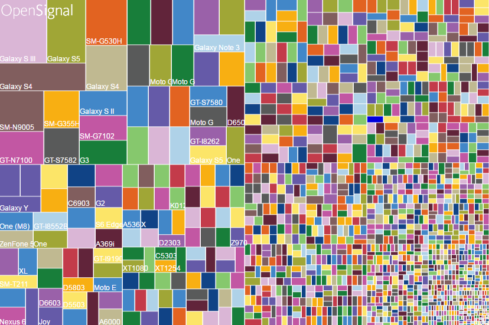
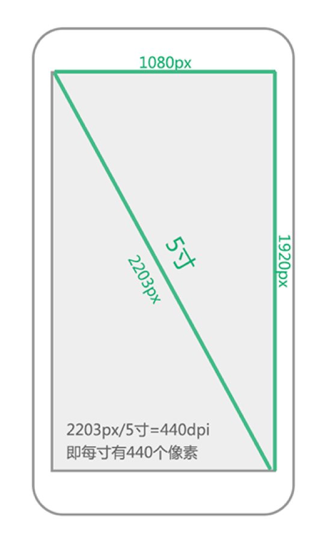
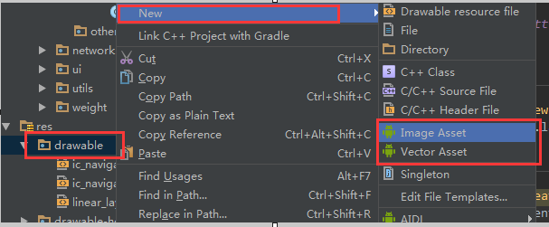
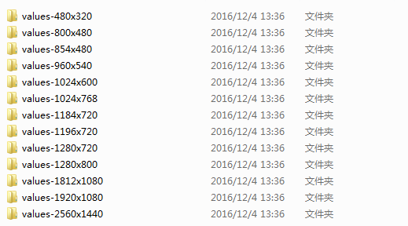
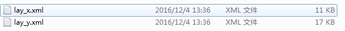
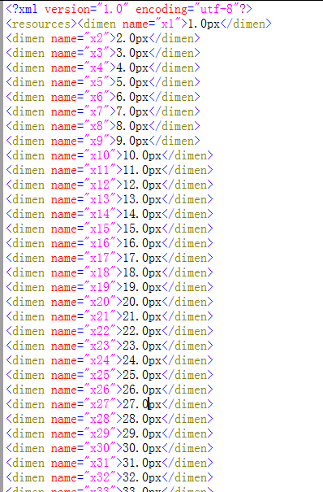

# Android中喜闻乐见的屏幕适配

## 引言

Andriod开源所带来的梗莫过于在各种不同型号、版本的手机中兼容的问题，同时成为每一位Android开发者中所要面临的挑战，或者说各种七七八八的问题来的毫无防备，本文接下来将主要介绍兼容性问题中适配问题。

## 基本概念

* 屏幕大小

	屏幕对角线的长度，通常使用“寸”来表示

* 分辨率
	
	指手机屏幕的像素点个数

* 屏幕像素密度（Pixels Per Inch）

	每英寸像素点个数。说的详细点就是对角线的像素点除以屏幕大小。

**结合屏幕以上几点，Android系统中定义了几个标准的DPI(PPI)值。**

密度 | ldpi | mdpi | hdpi | xhpi | xxhdpi|
----| ------|------|-----|------|-----|
密度值 | 120  | 160 | 240 | 320 | 480 |
分辨率 | 240X320 | 320X480 | 480X800 | 720X1280 | 1080X1920 |

* 独立像素dp

真是由于各种屏幕密度的不同，导致同样像素大小的长度在不同屏幕闪显示的长度有所不同。Android系统使用mdpi既160dpi作为标准在这个屏幕上 1px = 1dp，其他屏幕坐下比例换算，在hdpi(240dpi)中 1dp = 1.5px...(即ldpi:mdpi:hdpi:xhdpi:xxhdpi = 3:4:6:8:12)

* 独立像素sp

开发中关于设置字体的大小使用sp作为单位，这个单位所设置的字体受系统字体大小影响，推荐使用12sp、14sp、18sp、22sp作为字体设置的大小。

## 解决屏幕适配

有了关于屏幕的基本概念以后，在实际开发中碎片化的问题不断发生，于是乎，我们开始踏上屏幕适配之旅吧。

###图片适配

除了小猪在之前文章写道使用 [.9图片](１２３ "http://www.runoob.com/w3cnote/android-tutorial-9-image.html")以外，更多的时候我们要解决图片失真的问题。

**Android SDK加载图片流程**

>  1. Android SDK会根据屏幕密度自动选择对应的资源文件进行渲染加载，比如说，SDK检测到你手机的分辨率是xhdpi，会优先到xhdpi文件夹下找对应的图片资源；
> 2. 如果xhdpi文件夹下没有图片资源，那么就会去分辨率高的文件夹下查找，比如xxhdpi，直到找到同名图片资源，将它按比例缩小成xhpi图片；
> 3. 如果往上查找图片还是没有找到，那么就会往低分辨率的文件夹查找，比如hdpi，直到找到同名图片资源，将它按比例放大成xhpi图片。

对此在与美工配合的情况下，尽可能选择较大的图片,同时结合当前主流分辨率屏幕。

到此，关于适配的图片解决方案就到这里，接下来...停，我还没说完呢！！

在很多时候，我们只是使用到一些简单的图片，可以考虑到时候矢量图。

**Android 矢量图**

* 介绍：
> Android从Android5.0开始引入了对矢量图的支持，但是其并不支持svg这种矢量图片格式,，而是以VectorDrawable的方式来实现矢量图的效果。
> 
> Google官方关于矢量图的相关说明：[VectorDrawable相关说明](VectorDrawable相关说明 "https://developer.android.com/reference/android/graphics/drawable/VectorDrawable.html")

* 使用：
> 基本使用：Android Studio 中的使用 
> 
> 更多的学习（这里给大家指点一个方向，就不做深入说明了，不让跑题了）
> 
* [ Android开发中使用矢量图 ]( Android开发中使用矢量图  "http://blog.csdn.net/sg392361615/article/details/52764030")

###布局适配

就先从layout_weight开始说起吧，layout_weight是android.widget.LinearLayout的属性，说简单点就是只能在LinearLayout的子空间中才允许使用，当然wrap_content与match_parent也就不用了，想必使用方法想必大家都知道了，只是layout_weight使用有一些注意事项，我都不知道该不该废话了，算了！跳过（逃）。

###限定符

**尺寸限定符**

* 使用场景
	
>用过平板和手机的朋友想必应该见过，一个app会有这种情况，在手机中(较小的屏幕)，使用单面板分别显示内容。在平板中实施的是双面板模式显示更多内容。

* 使用方式
>我们可以使用尺寸限定符（layout-large）通过创建一个文件，这样，我们的目录就会变成这样,并且，我们给他放入不同的内容。

res/layout/activity_main.xml 

	<LinearLayout xmlns:android="http://schemas.android.com/apk/res/android"
  		android:orientation="vertical"
  		android:layout_width="match_parent"
  		android:layout_height="match_parent">
  		<fragment android:id="@+id/left_fragment"
            android:layout_height="match_parent"
            android:name="com.xlhgo.demo.LeftFragment"
            android:layout_width="match_parent" />
	</LinearLayout>

res/layout-large/activity_main.xml

	<LinearLayout xmlns:android="http://schemas.android.com/apk/res/android"
    	android:layout_width="match_parent"
    	android:layout_height="match_parent"
    	android:orientation="horizontal">
    	<fragment android:id="@+id/left_fragment"
             android:layout_height="match_parent"
             android:layout_width="0dp"
			 android:layout_weight="1" 
             android:name="com.xlhgo.demo.LeftFragment"
			/>
    	<fragment android:id="@+id/right_fragment"
             android:layout_height="match_parent"
             android:layout_width="0dp"
			 android:layout_weight="1" 
             android:name="com.xlhgo.demo.RightFragment />
	</LinearLayout> 

* 注意事项

> 这种方式只适合Android3.2之前，在之后，又有一个新的玩物

**最小宽度限定符**

在原尺寸限定符的基础上，large的存在非得模糊，Google爸爸就给大家带来一种新的玩法，就是最小宽度（Smallest-width）限度符。

* 使用方式

res/layout-sw600dp/activity_main.xml

	<LinearLayout xmlns:android="http://schemas.android.com/apk/res/android"
    	android:layout_width="match_parent"
    	android:layout_height="match_parent"
    	android:orientation="horizontal">
    	<fragment android:id="@+id/left_fragment"
             android:layout_height="match_parent"
             android:layout_width="0dp"
			 android:layout_weight="1" 
             android:name="com.xlhgo.demo.LeftFragment"
			/>
    	<fragment android:id="@+id/right_fragment"
             android:layout_height="match_parent"
             android:layout_width="0dp"
			 android:layout_weight="1" 
             android:name="com.xlhgo.demo.RightFragment />
	</LinearLayout> 

* 分析

> 也就是说，对于最小宽度大于等于 600 dp 的设备，系统会选择 layout-sw600dp/main.xml（双面板）布局，否则系统就会选择 layout/activity_main.xml（单面板）布局。

>但 Android 版本低于 3.2 的设备不支持此技术，原因是这些设备无法将 sw600dp 识别为尺寸限定符，因此我们仍需使用 large 限定符。这样一来，就会有一个名称为 res/layout-large/main.xml 的文件（与 res/layout-sw600dp/activity_main.xml 一样）。嘿嘿，Android早就看穿这一切了。

**使用布局别名**

为了解决上面的问题，我们就用使用布局别名。

* 使用方式：

>我们把原来 res/layout-sw600dp/activity_main.xml 布局移到 res/layoout/ 目录下，并且取名为 activity_main_(xxx).xml (xxx的命名规范最好可以规范下，统一标准)

> 接下里就看看 values-large 与 values-sw600dp 的布局吧

	<resources>
		<item name="main" type="layout">@layout/activity_main_(xxx)</item>
	</resources>

**屏幕方向（Orientation）限定符**

* res/layout-land
* res/layout-port
* res/layout-sw600dp-land
* res/layout-sw600dp-port

### dimen的使用

即便使用dp其实也不能完全的解决屏幕适配的问题，尤其是横向布局的时候最容易察觉，因为不同手机一个屏幕的宽高dp值各不相同，所以说无论怎么给控件分配dp值都无法很好的解决适配。

* 解决方案

> 我们将一个屏幕宽度分为320份，高度480份，然后按照实际像素对每一个单位进行复制，放在对应values-widthxheight文件夹下面的lay_x.xml和lay_y.xml里面，

* 具体代码

	import java.io.File;
	import java.io.FileNotFoundException;
	import java.io.FileOutputStream;
	import java.io.PrintWriter;

	/**
 	* Created by xlh on 2016/12/4.
 	*/
	public class MakeXml {
	    private final static String rootPath = "F:\\layoutroot\\values-{0}x{1}\\";
		//可以根据自己情况去更改
	    private final static float dw = 320f;
	    private final static float dh = 480f;
	
	    private final static String WTemplate = "<dimen name=\"x{0}\">{1}px</dimen>\n";
	    private final static String HTemplate = "<dimen name=\"y{0}\">{1}px</dimen>\n";
	
	    public static void main(String[] args) {
	        makeString(320, 480);
	        makeString(480, 800);
	        makeString(480, 854);
	        makeString(540, 960);
	        makeString(600, 1024);
	        makeString(720, 1184);
	        makeString(720, 1196);
	        makeString(720, 1280);
	        makeString(768, 1024);
	        makeString(800, 1280);
	        makeString(1080, 1812);
	        makeString(1080, 1920);
	        makeString(1440, 2560);
	    }
	
	    public static void makeString(int w, int h) {
	
	        StringBuffer sb = new StringBuffer();
	        sb.append("<?xml version=\"1.0\" encoding=\"utf-8\"?>\n");
	        sb.append("<resources>");
	        float cellw = w / dw;
	        for (int i = 1; i < 320; i++) {
	            sb.append(WTemplate.replace("{0}", i + "").replace("{1}",
	                    change(cellw * i) + ""));
	        }
	        sb.append(WTemplate.replace("{0}", "320").replace("{1}", w + ""));
	        sb.append("</resources>");
	
	        StringBuffer sb2 = new StringBuffer();
	        sb2.append("<?xml version=\"1.0\" encoding=\"utf-8\"?>\n");
	        sb2.append("<resources>");
	        float cellh = h / dh;
	        for (int i = 1; i < 480; i++) {
	            sb2.append(HTemplate.replace("{0}", i + "").replace("{1}",
	                    change(cellh * i) + ""));
	        }
	        sb2.append(HTemplate.replace("{0}", "480").replace("{1}", h + ""));
	        sb2.append("</resources>");
	
	        String path = rootPath.replace("{0}", h + "").replace("{1}", w + "");
	        File rootFile = new File(path);
	        if (!rootFile.exists()) {
	            rootFile.mkdirs();
	        }
	        File layxFile = new File(path + "lay_x.xml");
	        File layyFile = new File(path + "lay_y.xml");
	        try {
	            PrintWriter pw = new PrintWriter(new FileOutputStream(layxFile));
	            pw.print(sb.toString());
	            pw.close();
	            pw = new PrintWriter(new FileOutputStream(layyFile));
	            pw.print(sb2.toString());
	            pw.close();
	        } catch (FileNotFoundException e) {
	            e.printStackTrace();
	        }
	
	    }
	
	    public static float change(float a) {
	        int temp = (int) (a * 100);
	        return temp / 100f;
	    }
	}

>  
>  相对应每个目录下都有lay_x.xml和lay_y.xml
>  
>  里面的代码也非常的有规律
>  

* 使用方式
> 有了这些文件以后，使用起来就非常方便了，假设美工给我的图是320*480的就可以直接这样子调用 android:layout_xxx="@dimen/xxxx"

### 百分比布局

关于百分比布局，如果鄙人没记错应该是在15年初的新物，因为是google的亲儿子，所以话不多说，先直接上官网链接：[android-percent-support-lib-sample](https://github.com/JulienGenoud/android-percent-support-lib-sample "android-percent-support-lib-sample")

无非就是百分比布局，如果能和美工进行合理的沟通，这将是Android开发中一个不错的选择。

	<?xml version="1.0" encoding="utf-8"?>
	<android.support.percent.PercentRelativeLayout
		xmlns:android="http://schemas.android.com/apk/res/android"
		xmlns:app="http://schemas.android.com/apk/res-auto"
		android:layout_width="match_parent"
		android:layout_height="wrap_content">
	
		<Button
			android:layout_width="0dp"
			android:layout_height="wrap_content"
			android:text="30%"
			app:layout_widthPercent="30%"/>
		
		<Button
			android:layout_width="0dp"
			android:layout_height="wrap_content"
			android:layout_alignParentRight="true"
			android:text="20%"
			app:layout_widthPercent="20%"/>
	
	</android.support.percent.PercentRelativeLayout>

### 其他工具的使用

除了以上这些传统的屏幕适配方案，鄙人在很久以前开发一个外包的项目使用到了一个非常有意思的工具，就是 鸿神的[Android屏幕自动适配](Android屏幕自动适配 "https://github.com/zhengjingle/Autolayout")。因为美工给我的图片是ios的尺寸，使用了之后简直是大快人心，当然博主在后来的面试社交中提到关于这个适配方案，被告知会在某种情况下出现bug，所以现在开始抱有谨慎的情况。。。但是总的来说还是比较少的吧，至少我没直接遇到（一定是我太low了）。

##尾声
到此，我的第一篇文章已经结束，不知道给大家带来的效果如何，关于markdown文档编辑的格式欢迎直接，说真的，我也中感觉哪里有点别扭。。

